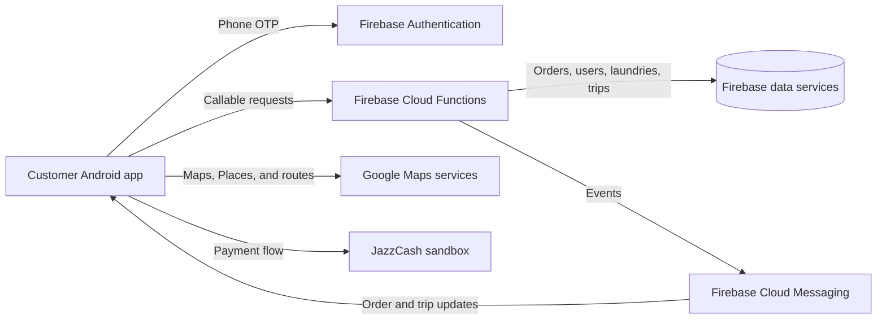

# Laundromat Customer

The customer Android app for **Laundromat**, my 2021 BSc Software Engineering final-year project at the International Islamic University Islamabad. Customers can find nearby laundries, book cleaning services, and follow pickup and delivery.

## What the customer app does

| Area | Client behavior |
| --- | --- |
| Account | Customer sign-up, phone OTP verification through Firebase Authentication, login with phone/password, password recovery, profile editing, and logout. |
| Addresses | Pick a location on a Google map, use Places autocomplete, and add, edit, delete, or select saved delivery addresses. |
| Laundry discovery | Request laundries near the selected address, browse shop and home-based providers, search/filter the list, and inspect a laundry's services and estimated distance. |
| Booking | Choose a laundry's items, service types, and quantities; review or clear a single-laundry cart; see pricing; select cash or JazzCash; and send an order request. |
| Orders | View current and past orders, order details and status, cancel an eligible order, and see transaction history. |
| Delivery | Receive order/trip updates through Firebase Cloud Messaging, view a driver's reported location and route on a map, see an estimated arrival, and use pickup/delivery confirmation screens. |

## Customer journey

1. Register or log in, including phone OTP verification, then choose a delivery location.
2. Browse nearby laundries and select an item and cleaning service from a provider's menu.
3. Adjust quantities in the cart, review the order, select **cash** or **JazzCash**, and submit an order request.
4. Follow merchant acceptance, collection, cleaning, and return delivery through order status updates and notifications.
5. During a trip, view the driver's location and route. At handover, use the confirmation code shown in the app. The JazzCash path has separate order and trip-fare payment screens.

Order states include `REQUESTED`, `ACCEPTED`, `PICKUP_REQUESTED`, `COLLECTED`, `IN_SERVICE`, `WASHED`, `DELIVERING`, `COMPLETED`, `CANCELLED`, and `DECLINED`.

## How it is built

- **Platform:** native Android, Java 8 language features, XML layouts, Material Components.
- **Build:** Gradle 6.7.1 wrapper, Android Gradle Plugin 4.2.2, `compileSdkVersion`/`targetSdkVersion` 30, `minSdkVersion` 23 (Android 6.0).
- **Backend:** Firebase Authentication for phone verification; Firebase callable Cloud Functions for accounts, laundries, orders, trips, and payments; Firebase Cloud Messaging for customer notifications. The Gradle project also includes Firebase Storage, Firestore, and Analytics libraries.
- **Location and media:** Google Maps SDK, Places SDK, Google Play location services, Maps Utils, an image picker, and image loading libraries.
- **Payments:** cash selection and a JazzCash sandbox WebView flow.

The client calls functions such as `laundry-getNearbyLaundries`, `order_task-sendOrderRequest`, `order_task-getOrderById`, `delivery_boy-getLiveLocation`, and `payment-setOrderPayed`. Their implementations are in the [Cloud Functions repository](https://github.com/taymoor-ghazanfar/laundromat-cloud-functions).



Java models hold customer, cart, order, and trip data. Adapters render lists and menus; the messaging service handles order and trip events. Driver tracking fetches live-location data through a callable function, then draws the route and estimates arrival in the client. Local preferences and `Session` hold cart and login state.

### Repository layout

```text
app/
  build.gradle                 Android app configuration and dependencies
  src/main/AndroidManifest.xml Activities, permissions, and messaging service
  src/main/java/com/laundromat/customer/
    activities/               Main screens and customer flows
    dialogs/, fragments/      Profile, address, login, and order UI
    model/                    Customer, laundry, cart, order, trip, and payment models
    prefs/                    Local session and cart preferences
    services/                 Firebase messaging and notifications
    ui/                       Adapters, view holders, and custom views
    utils/, helpers/          Validation, parsing, location, and map route helpers
  src/main/res/               XML layouts, strings, themes, icons, and images
gradle/wrapper/               Gradle wrapper
```

## Build and run

### Prerequisites

- Android Studio with the Android SDK and Build Tools for API 30.
- A JDK compatible with the included Gradle 6.7.1 and Android Gradle Plugin 4.2.2 configuration.
- An Android device or emulator running Android 6.0 (API 23) or later, with Google Play services for the location and Firebase flows.
- Access to a Firebase project with the matching callable Cloud Functions and Firebase Authentication phone sign-in enabled. Configure the Google Maps and Places APIs for that project as well.

1. Clone this repository and open its root directory in Android Studio.
2. Supply Firebase Android configuration for application ID `com.laundromat.customer` at `app/google-services.json`.
3. Configure `google_maps_api_key` and `google_api_key` in `app/src/main/res/values/strings.xml` for Maps, routes, and Places.
4. Deploy the matching backend functions and configure the JazzCash sandbox values used by `JazzCashActivity` for the payment flow.
5. Select the app run configuration in Android Studio, or run `./gradlew :app:assembleDebug` (`.\gradlew.bat :app:assembleDebug` on Windows). Install the resulting debug APK on a device or emulator.

The manifest requests internet, location, camera, and external-storage access for the app's account, address, map, and image features. It marks a camera as required.

## Related repositories

- [Customer app](https://github.com/taymoor-ghazanfar/laundromat-customer) — customer accounts, laundry discovery, booking, and order tracking (this repository).
- [Merchant app](https://github.com/taymoor-ghazanfar/laundromat-merchant) — laundry registration, catalog, orders, and fulfillment.
- [Delivery app](https://github.com/taymoor-ghazanfar/laundromat-delivery) — trip requests, navigation, and handovers.
- [Admin app](https://github.com/taymoor-ghazanfar/laundromat-admin) — approvals and system administration.
- [Cloud Functions](https://github.com/taymoor-ghazanfar/laundromat-cloud-functions) — shared backend operations and notifications.

## Academic context and license

Developed by **Taymoor Ghazanfar**, supervised by **Dr. Muhammad Nadeem**, International Islamic University Islamabad (2021).

The repository includes an [Apache License 2.0](LICENSE) file.
